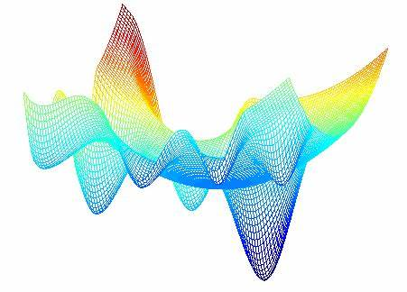

<h1 align="center">Estimating the Yield of Digital Green Crop</h2>

  
  
  
  
  
  

<h4 align="center">A focus on Bayesian Optimization</h4>

<strong>Note: This repository was private till the end of the competition</strong>

<h2>Overview and Objective</h2>

Getting started with DS competition on Zindi - hyperparameter optimization - Bayes Optimatization.

<h2>Data</h2>

The data comprises more than 5000 data points, each having more than 40 features and was collected through a survey conducted across multiple districts in India. It consists of a variety of factors that could potentially impact the yield of rice crops. These factors include things like the type and amount of fertilizers used, the quantity of seedlings planted, methods of preparing the land, different irrigation techniques employed, among other features. You can read more about the data on the <a href="https://zindi.africa/competitions/digital-green-crop-yield-estimate-challenge/data">competition page</a>.

<h2>Performance</h2>

I used three hyperparameter optimization techniques: Grid Search, Randomized Search and Bayes Optimization. The performance of each model can be found in the <a href="https://zindi.africa/competitions/digital-green-crop-yield-estimate-challenge/data">notebook</a>.

